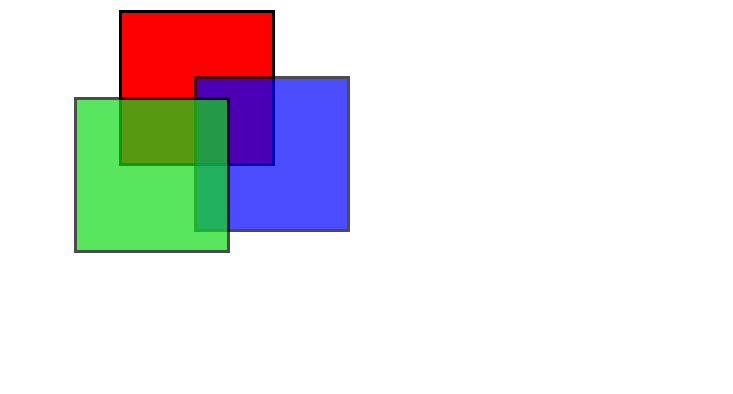

# -Creative-Box-Placement-Playing-with-Colors-and-Transformations-
This HTML and CSS code showcases a creative arrangement of colored boxes, each with unique styles.
Three div elements, each assigned a distinct class (red, blue, and green), are presented on the webpage. The first div (class="red") is a standard red box positioned with a margin to the left. The second div (class="blue") introduces opacity, a blue color, and a translate transformation, resulting in a partially transparent, displaced blue box. The third div (class="green") combines opacity, a green color, and a translate transformation, producing a partially transparent green box that appears shifted from its original position. This code serves as a playful exploration of CSS styling, offering a glimpse into the possibilities of combining colors and transformations to create visually interesting layouts on a webpage.

